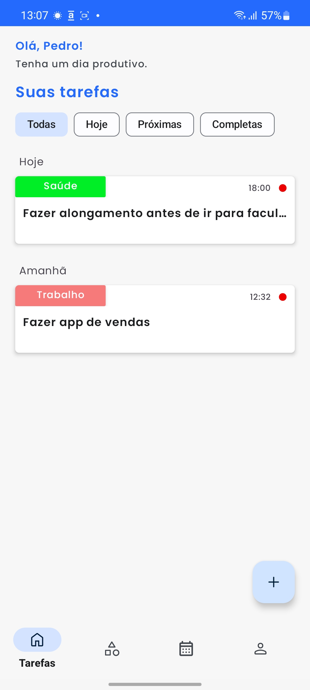
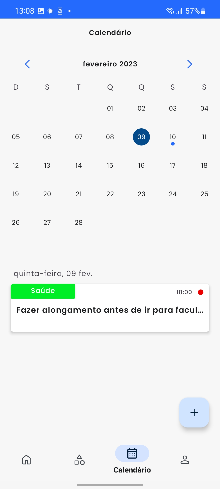
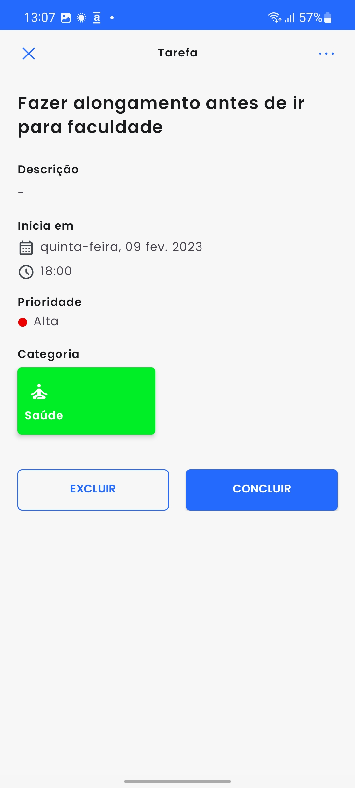
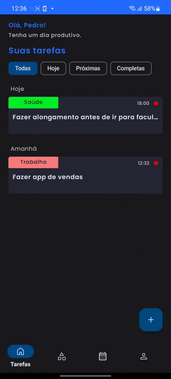
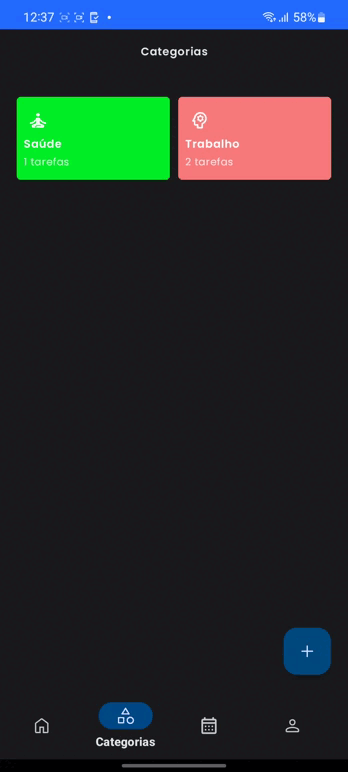
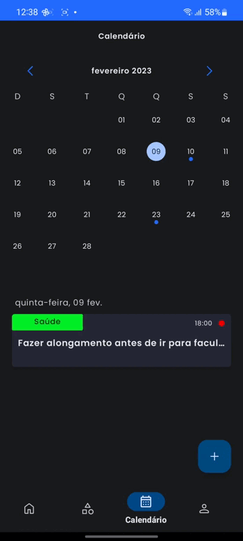
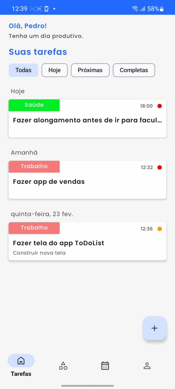
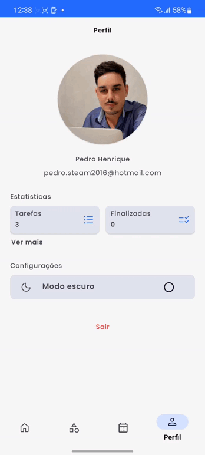

<h1 align="center">To Do List</h1>

<p align="center">
  <a href="https://opensource.org/licenses/GPL-3.0"></a>
  <a href="https://android-arsenal.com/api?level=26"></a>
  <br>
  <a href="https://wa.me/+5574999637391"></a>
  <a href="https://www.linkedin.com/in/pedro-henrique-de-souza-araujo/"></a>
  <a href="mailto:pedro.steam2016@hotmail.com"></a>
</p>

<p align="center">  

⭐ Esse é um projeto de criação própria para demonstrar meu conhecimento técnico no desenvolvimento Android nativo com Kotlin. Mais informações técnicas abaixo.

Aplicativo que permite o usuário criar tarefas e categorias, com uma listagem por ordem de data/hora na tela principal, oferece também uma visualização no calendário destacando os dias que tem tarefas em aberto e por último, uma tela de perfil permite o usuário visualizar gráficos relacionando suas tarefas completas/pendentes e uma relação de tarefas por categoria.
</p>

</br>

<p float="left" align="center">



</p>

## Download
Faça o download do <a href="apk/app-debug.apk?raw=true">APK diretamente</a>. Você pode ver <a href="https://www.google.com/search?q=como+instalar+um+apk+no+android">aqui</a> como instalar uma APK no seu aparelho android.
Certifique-se de que o aparelho esteja com uma conta Google logada para conseguir testar o app.

## Clonar repositório
Para clonar e buildar o app será necessario criar um conta no Firebase, iniciar um novo projeto e o banco de dados Firestore, após esses passos, baixar o google-services.json do projeto criado no Firebase e colocar na pasta "app" do projeto.

## Tecnologias usadas e bibliotecas de código aberto

- Minimum SDK level 26
- [Linguagem Kotlin](https://kotlinlang.org/)

- Jetpack
  - Navigation Component: O Navigation Component ajuda você a implementar a navegação, desde simples cliques em botões até padrões mais complexos, como barras de aplicativos e a gaveta de navegação.
  - Lifecycle: Observe os ciclos de vida do Android e manipule os estados da interface do usuário após as alterações do ciclo de vida.
  - ViewModel: Gerencia o detentor de dados relacionados à interface do usuário e o ciclo de vida. Permite que os dados sobrevivam a alterações de configuração, como   rotações de tela.
  - ViewBinding: Liga os componentes do XML no Kotlin através de uma classe que garante segurança de tipo e outras vantagens.
  - Custom Views: View customizadas feitas do zero usando XML.

- Arquitetura
  - MVVM (View - ViewModel - Model) com Clean Architecture
  - Comunicação da ViewModel com a View através de LiveData
  - Comunicação da ViewModel com a Model através de UseCases
  - Repositories para abstração da comunicação com a camada de dados.
  - Injeção de dependência com Hilt.
  
- Bibliotecas
  - [Firebase](https://firebase.google.com/?hl=pt-br): Para persistência de dados e autenticação.
  - [Picasso](https://github.com/square/picasso): Para carregamento de imagens.
  - [MPAndroidChart](https://github.com/PhilJay/MPAndroidChart): Para gerar gráficos.
  - [Lottie Animation](https://github.com/airbnb/lottie-android): Para animações.

## Arquitetura
**To Do List** utiliza a arquitetura MVVM com Clean Architecture, que segue as [recomendações oficiais do Google](https://developer.android.com/topic/architecture).
</br></br>

<p float="left" align="center">
 
</p>

## Features

### Criar tarefas e categorias
<p float="left" align="left">
  
  
</p>

### Visualização no calendário


### Deletar e completar tarefas


### Perfil e estatísticas


### Dark Mode


# Licença
```xml
    Copyright (C) <2023>  <https://github.com/Pedroid1>

    This program is free software: you can redistribute it and/or modify
    it under the terms of the GNU General Public License as published by
    the Free Software Foundation, either version 3 of the License, or
    (at your option) any later version.

    This program is distributed in the hope that it will be useful,
    but WITHOUT ANY WARRANTY; without even the implied warranty of
    MERCHANTABILITY or FITNESS FOR A PARTICULAR PURPOSE.  See the
    GNU General Public License for more details.

    You should have received a copy of the GNU General Public License
    along with this program.  If not, see <http://www.gnu.org/licenses/>.
```
